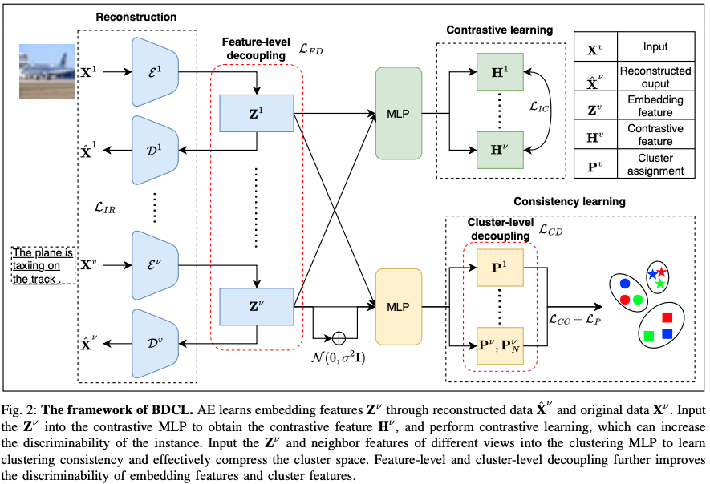

# Multi-view Clustering via Bi-level Decoupling and Consistency Learning
## Abstract
Multi-view clustering has shown to be an effective method for analyzing underlying patterns in multi-view data. The performance of clustering can be improved by learning the consistency and complementarity between multi-view features, however, cluster-oriented representation learning is often overlooked. In this paper, we propose a novel Bi-level Decoupling and Consistency Learning framework (BDCL) to further explore the effective representation for multi-view data to enhance inter-cluster discriminability and intra-cluster compactness of features in multi-view clustering. Our framework comprises three modules: 1) The multi-view instance learning module aligns the consistent information while preserving the private features between views through reconstruction autoencoder and contrastive learning. 2) The bi-level decoupling of features and clusters enhances the discriminability of feature space and cluster space. 3) The consistency learning module treats the different views of the sample and their neighbors as positive pairs, learns the consistency of their clustering assignments, and further compresses the intra-cluster space. Experimental results on five benchmark datasets demonstrate the superiority of the proposed method compared with the SOTA methods. Our code is published on https://github.com/LouisDong95/BDCL.
## Pipline

## Experiments
```python
python train.py --dataset MNIST_USPS
```
## Cite
If you find the code useful in your research, please consider citing our paper:
```
@inproceedings{DBLP:conf/ijcnn/DongIJCNN25,
  author       = {Shihao Dong and
                  Yuhui Zheng and
                  Huiying Xu and
                  Xinzhong Zhu},
  title        = {Multi-view Clustering via Bi-level Decoupling and Consistency Learning},
  booktitle    = {International Joint Conference on Neural Networks},
  year         = {2025}
}
```